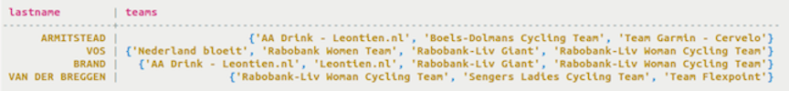

# Creating the set type {#useSet .task}

Using the set data type, store unordered multiple items.

A set consists of a group of elements with unique values. Duplicate values will not be stored distinctly. The values of a set are stored unordered, but will return the elements in sorted order when queried. Use the set data type to store data that has a many-to-one relationship with another column. For example, in the example below, a set called teams stores all the teams that a cyclist has been a member of during their career.

-   Define teams in a table cyclist\_career\_teams. Each team listed in the set will have a textdata type.

    ```
    cqlsh> CREATE TABLE cycling.cyclist_career_teams ( id UUID PRIMARY KEY, lastname text, teams set<text> );
    ```

    


**Parent topic:** [Creating collections](../../cql/cql_using/useCollections.md)

