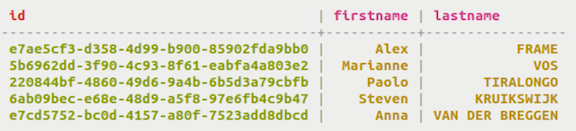

# Simple Primary Key {#useSimplePrimaryKeyConcept .concept}

A simple primary key consists of only the partition key which determines which node stores the data.

For a table with a simple primary key, Cassandra uses one column name as the partition key. The primary key consists of only the partition key in this case. Data stored with a simple primary key will be fast to insert and retrieve if many values for the column can distribute the partitions across many nodes.

Often, your first venture into using Cassandra involves tables with simple primary keys. Keep in mind that only the primary key can be specified when retrieving data from the table \(unless you use [secondary indexes](useCreateQueryIndexes.md)\). If an application needs a simple lookup table using a single unique identifier, then a simple primary key is the right choice. The table shown uses id as the primary key.



If you have simple retrieval needs, [use a simple primary key](useSimplePrimaryKeyConcept.md#).

**Parent topic:** [Creating a table](../../cql/cql_using/useCreateTableTOC.md)

## Using a simple primary key {#useSimplePrimaryKey}

Use a simple primary key to create columns that you can query to return sorted results.

Use a simple primary key to create a single column that you can use to query and return results. This example creates a cyclist\_name table storing an ID number and a cyclist's first and last names in columns. The table uses a UUID as a [primary key](/en/glossary/doc/glossary/gloss_primary_key.html). This table can be queried to discover the name of a cyclist given their ID number.

A simple primary key table can be created in three different ways, as shown.

-   Create the table cyclist\_name in the cycling keyspace, making id the primary key. Insert the `PRIMARY KEY` keywords after the column name in the `CREATE TABLE` definition. Before creating the table, set the keyspace with a `USE` statement.

    ```
    cqlsh> USE cycling;
    CREATE TABLE cyclist_name ( id UUID PRIMARY KEY, lastname text, firstname text );
    ```

-   This same example can be written with the primary key identified at the end of the table definition. Insert the `PRIMARY KEY` keywords after the last column definition in the `CREATE TABLE` definition, followed by the column name of the key. The column name is enclosed in parentheses.

    ```
    cqlsh> USE cycling;
    CREATE TABLE cyclist_name ( id UUID, lastname text, firstname text, PRIMARY KEY (id) );
    ```

-   The keyspace name can be used to identify the keyspace in the `CREATE TABLE` statement instead of the `USE` statement.

    ```
    cqlsh> CREATE TABLE cycling.cyclist_name ( id UUID, lastname text, firstname text, PRIMARY KEY (id) );
    ```


