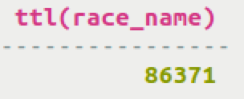
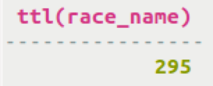

# Determining time-to-live \(TTL\) for a column {#useTTL .task}

How to insert and retrieve data pertaining to TTL for columns.

To set the TTL for data, use the `USING TTL` keywords. The `TTL` function may be used to retrieve the TTL information.

The `USING TTL` keywords can be used to insert data into a table for a specific duration of time. To determine the current time-to-live for a record, use the `TTL` function.

-   Insert data into the table cycling.calendar and use the `USING TTL` clause to set the expiration period to 86400 seconds.

    ```
    INSERT INTO cycling.calendar (race_id, race_name, race_start_date, race_end_date) VALUES (200, 'placeholder','2015-05-27', '2015-05-27') USING TTL 86400;
    ```

-   Issue a SELECT statement to determine how much longer the data has to live.

    ```
    SELECT TTL (race_name) from cycling.calendar WHERE race_id = 200;
    ```

    

    If you repeat this step after some time, the time-to-live value will decrease.

-   The time-to-live value can also be updated with the USING TTL keywords in an `UPDATE` command.

    ```
    UPDATE cycling.calendar USING TTL 300 SET race_name = 'dummy' WHERE race_id = 200 AND race_start_date = '2015-05-27' AND race_end_date = '2015-05-27';
    ```

    


**Parent topic:** [Using CQL](../../cql/cql_using/useAboutCQL.md)

