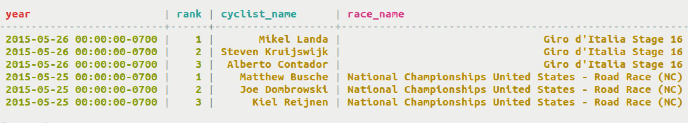
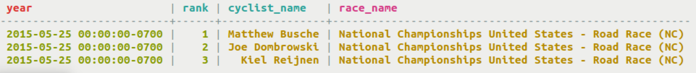
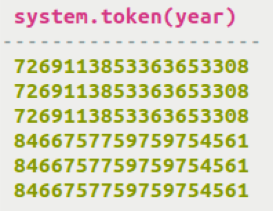
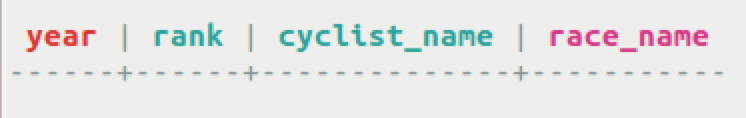

# Displaying rows from an unordered partitioner with the TOKEN function {#useToken .task}

How to use CQL to display rows from an unordered partitioner.

The ByteOrdered partitioner arranges tokens the same way as key values, but the RandomPartitioner and Murmur3Partitioner distribute tokens in a completely unordered manner. When using the RandomPartitioner or Murmur3Partitioner, Cassandra rows are ordered by the hash of their partition key, or for one partition queries, rows are ordered by their clustering key. Hence, the order of rows is not meaningful, because of the hashes generated.

To order the rows for display when using RandomPartitioner or Murmur3Partitioner, the token function may be used. However, ordering with the `TOKEN` function does not always provide the expected results. Use the `TOKEN` function to express a conditional relation on a partition key column. In this case, the query returns rows based on the token of the partition key rather than on the value.

The `TOKEN` function can also be used to select a range of partitions for a ByteOrderedPartitioner. Using the `TOKEN` function with ByteOrderedPartitioner will generally yield expected results.

The type of the arguments to the `TOKEN` function depends on the type of the columns used as the argument of the function. The return type depends on the partitioner in use:

-   Murmur3Partitioner, bigint
-   RandomPartitioner, varint
-   ByteOrderedPartitioner, blob

-   Select data based on a range of tokens of a particular column value.

    ```
    SELECT * FROM cycling.last_3_days WHERE TOKEN(year) > TOKEN('2015-05-24');
    ```

    

-   The results will not always be consistent with expectations, because the token function actually queries directly using tokens. Underneath, the token function uses token-based comparisons and does not convert year to token \(not year \> '2015-05-26'\).

    ```
    SELECT * FROM cycling.last_3_days WHERE TOKEN(year) > TOKEN('2015-05-26');
    ```

    

-   Display the tokens for all values of the column year.

    ```
    SELECT TOKEN(year) FROM cycling.last_3_days;
    ```

    

-   Tokens and partition keys can be mixed in conditional statements. The results will not always be straightforward, but they are not unexpected if you understand what the `TOKEN` function does.

    ```
    SELECT * FROM cycling.last_3_days WHERE TOKEN(year) < TOKEN('2015-05-26') AND year IN ('2015-05-24','2015-05-25');
    ```

    


**Parent topic:** [Using CQL](../../cql/cql_using/useAboutCQL.md)

