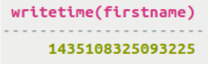

# Determining the date/time of a write {#useWritetime .task}

Using the WRITETIME function in a SELECT statement to determine when the date/time that the column was written to the database.

A table contains a timestamp representing the date/time that a write occurred to a column. Using the WRITETIME function in a SELECT statement returns the date/time that the column was written to the database. The output of the function is microseconds except in the case of Cassandra 2.1 counter columns. Counter column writetime is milliseconds. This procedure continues the example from the previous procedure and calls the WRITETIME function to retrieve the date/time of the writes to the columns.

-   Retrieve the date/time that the value Paolo was written to the firstname column in the table cyclist\_points. Use the WRITETIME function in a SELECT statement, followed by the name of a column in parentheses:

    ```
    SELECT WRITETIME (firstname) FROM cycling.cyclist_points WHERE id=220844bf-4860-49d6-9a4b-6b5d3a79cbfb;
    ```

    

    **Note:** The writetime output in microseconds converts to Wed, 24 Jun 2015 01:12:05 GMT.


**Parent topic:** [Using CQL](../../cql/cql_using/useAboutCQL.md)

