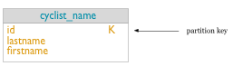
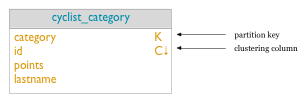

# Data modeling concepts {#dataModelingApproach .concept}

How data modeling should be approached for Cassandra. A Pro Cycling statistics example is used throughout the CQL document.

Data modeling is a process that involves identifying the entities \(items to be stored\) and the relationships between entities. To create your data model, identify the patterns used to access data and the types of queries to be performed. These two ideas inform the organization and structure of the data, and the design and creation of the database's tables. [Indexing the data](../cql_using/useCreateQueryIndexes.md) can lead to either performance or degradation of queries, so understanding indexing is an important step in the data modeling process.

Data modeling in Cassandra uses a query-driven approach, in which specific queries are the key to organizing the data. Queries are the result of selecting data from a table; schema is the definition of how data in the table is arranged. Cassandra's database design is based on the requirement for fast reads and writes, so the better the schema design, the faster data is written and retrieved.

In contrast, relational databases normalize data based on the tables and relationships designed, and then writes the queries that will be made. Data modeling in relational databases is table-driven, and any relationships between tables are expressed as table joins in queries.

Cassandra's data model is a partitioned row store with tunable consistency. Tunable consistency means for any given read or write operation, the client application decides how consistent the requested data must be. Rows are organized into tables; the first component of a table's primary key is the partition key; within a partition, rows are clustered by the remaining columns of the key. Other columns can be indexed separately from the primary key. Because Cassandra is a distributed database, efficiency is gained for reads and writes when data is grouped together on nodes by partition. The fewer partitions that must be queried to get an answer to a question, the faster the response. Tuning the consistency level is another factor in latency, but is not part of the data modeling process.

Cassandra data modeling focuses on the queries. Throughout this topic, the example of Pro Cycling statistics demonstrates how to model the Cassandra table schema for specific queries. The conceptual model for this data model shows the entities and relationships.

The entities and their relationships are considered during table design. Queries are best designed to access a single table, so all entities involved in a relationship that a query encompasses must be in the table. Some tables will involve a single entity and its attributes, like the first example shown below. Others will involve more than one entity and its attributes, such as the second example. Including all data in a single Cassandra table contrasts with a relational database approach, where the data would be stored in two or more tables and foreign keys would be used to relate the data between the tables. Because Cassandra uses this single table-single query approach, queries can perform faster.

One basic query \(Q1\) for Pro Cycling statistics is a list of cyclists, including each cyclist's id, firstname, and lastname. To uniquely identify a cyclist in the table, an id using UUID is used. For a simple query to list all cyclists a table that includes all the columns identified and a partition key \(K\) of id is created. The diagram below shows a portion of the logical model for the Pro Cycling data model.

  

A related query \(Q2\) searches for all cyclists by a particular race category. For Cassandra, this query is more efficient if a table is created that groups all cyclists by category. Some of the same columns are required \(id, lastname\), but now the primary key of the table includes category as the partition key \(K\), and groups within the partition by the id \(C\). This choice ensures that unique records for each cyclist are created.

  

These are two simple queries; more examples will be shown to illustrate data modeling using CQL.

Notice that the main principle in designing the table is not the relationship of the table to other tables, as it is in relational database modeling. Data in Cassandra is often arranged as one query per table, and data is repeated amongst many tables, a process known as [denormalization](/en/glossary/doc/glossary/gloss_denormalization.html). Relational databases instead [normalize](/en/glossary/doc/glossary/gloss_normalization.html) data, removing as much duplication as possible. The relationship of the entities is important, because the order in which data is stored in Cassandra can greatly affect the ease and speed of data retrieval. The schema design captures much of the relationship between entities by including related attributes in the same table. Client-side joins in application code is used only when table schema cannot capture the complexity of the relationships.

**Parent topic:** [CQL data modeling](../../cql/ddl/ddlCQLDataModelingTOC.md)

**Previous topic:** [CQL data modeling](../../cql/ddl/ddlCQLDataModelingTOC.md)

**Next topic:** [Data modeling analysis](../../cql/ddl/dataModelingAnalysis.md)

